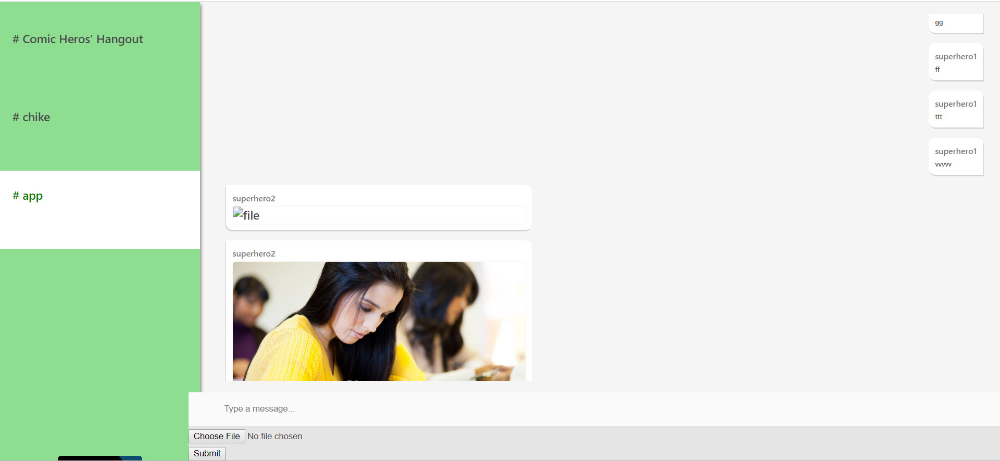

**Build a chat application with file sharing functionality**

Read the full tutorial here:


[Build a chat application with file sharing functionality](LINK) 

This tutorial shows how to build a group chat with file sharing functionality:



[Login view](src/screenshots/login.Png "Login")

**Technology**
This demo uses:

* CometChat Pro JS SDK
* ReactJs
* JavaScript


**Running the demo**

To run the demo follow these steps:

* Download the repository [here](https://github.com/ugbechike/group-chat)
* Run the command ```npm install or yarn```
* Add your ```appId, GUID and apiKey```

```export default {```
  ```appId: "", //Enter your App ID```
 ```apiKey: "", //Enter your API KEY```
  ```GUID: "", // Enter your group UID};```

* Run the app with ```npm start or yarn start```

**Useful links**

*🏠 [CometChat Homepage](https://www.cometchat.com/)
*👾 [CometChat JS SDK documentation](https://prodocs.cometchat.com/docs/js-quick-start)


##`npm install or yarn

Installs all the neccessary dependencies in the package.json file

In the project directory, you can run:

### `npm start`

Runs the app in the development mode.<br>
Open [http://localhost:3000](http://localhost:3000) to view it in the browser.

The page will reload if you make edits.<br>
You will also see any lint errors in the console.


This example shows how to build  group chat with reactjs:

### SCREENSHOT 

please find the screenshots inside the screenshot folder
